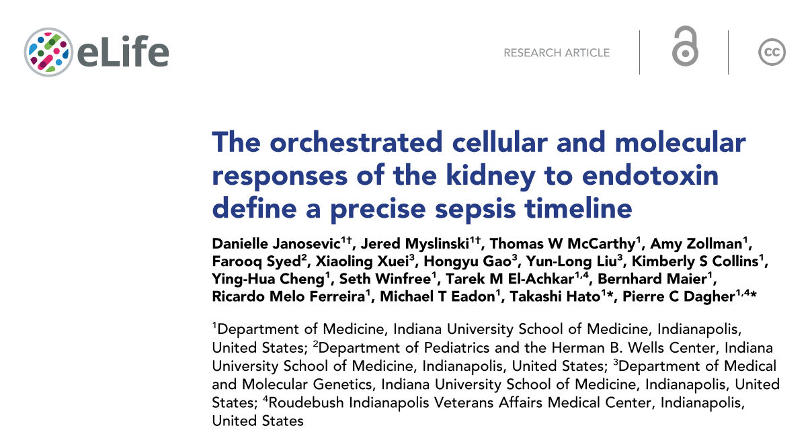
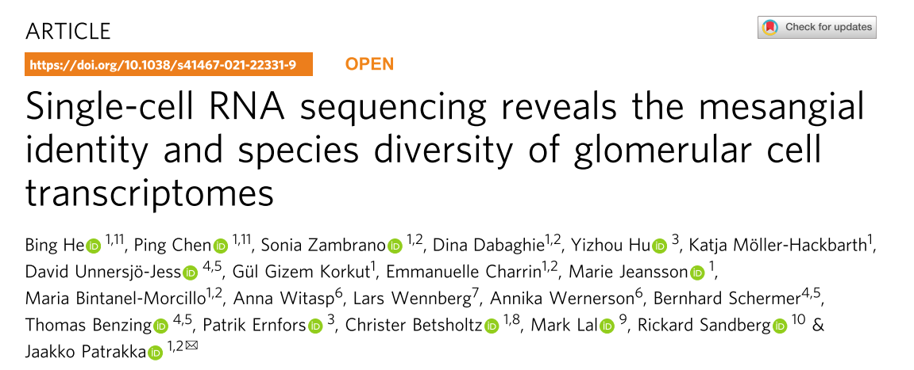
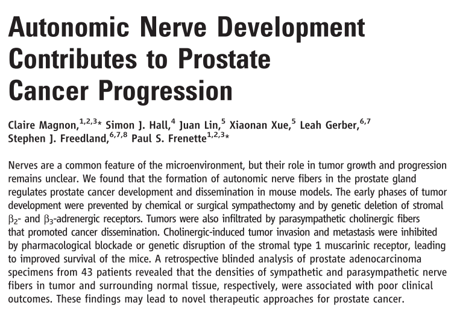

```{r setup, include=FALSE}
knitr::opts_chunk$set(echo = FALSE)
```

```{r, message=FALSE, warning=FALSE}
library(tidyverse)
library(fgsea)
library(msigdbr)
library(cluster)
library(org.Mm.eg.db)
library(biomaRt)
```


# kidney PB3 Pdgfrb
```{r, out.width='80%', fig.align='center'}
asma_pdgfrb <- readxl::read_xlsx("G:/data/kidney/Tumor/PB3/kidney-PB3-WT/a-SMA-Pdgfrb/01-40x-5x1-tile-image/region-for-counting/kidney-PB3-WT-asma-pdgfrb.xlsx")
colnames(asma_pdgfrb) <- c("file", "single-positive", "double-positive")
asma_pdgfrb$gene <- "a-SMA"

fsp1_pdgfrb <- readxl::read_xlsx("G:/data/kidney/Tumor/PB3/kidney-PB3-WT/FSP1-Pdgfrb/region-for-counting/kidney-PB3-WT-fsp1-pdgfrb.xlsx")
colnames(fsp1_pdgfrb) <- c("file", "single-positive", "double-positive")
fsp1_pdgfrb$gene <- "Fsp1"

vimentin_pdgfrb <- readxl::read_xlsx("G:/data/kidney/Tumor/PB3/kidney-PB3-WT/vimentin-Pdgfrb/01-20x-5x1-tile-image/region-for-counting/kidney-PB3-WT-vimentin-pdgfrb.xlsx")
colnames(vimentin_pdgfrb) <- c("file", "single-positive", "double-positive")
vimentin_pdgfrb$gene <- "Vimentin"

asma_pdgfrb %>% rbind(fsp1_pdgfrb) %>% rbind(vimentin_pdgfrb) %>% 
  rowwise() %>% 
  mutate(ratio = round(`double-positive` / `single-positive`, 4) * 100) %>% 
  ggplot(aes(gene, ratio)) +
  geom_violin(aes(fill = gene)) +
  geom_jitter(width = 0.1) +
  guides(fill = "none") +
  scale_fill_brewer(type = "qual", palette = "Set3") +
  scale_y_continuous(name = NULL, breaks = seq(10, 60, 10), labels = paste(seq(10, 60, 10), "%", sep = "")) +
  theme_classic() +
  labs(title = "kidney WT PB3 Pdgfrb expression percentage")

ggsave("G:/data/kidney/Tumor/PB3/kidney-PB3-WT/kidney-WT-PB3-Pdgfrb-expression.tiff",
       width = 10, height = 6.2)
```


---

# Kidney LPS 
```{r, out.width='80%', fig.align='center'}

```

- time points: 0, 1, 4, 16, 27, 36, 48 hours  
- tail vein injection LPS 5mg/kg  

```{r, out.width='80%', fig.align='center'}

```


----

# kidney macrophage
```{r}
kidney_macrophage <- readxl::read_xlsx("F:/git/sslab/kidney/data/20200530_DE_FDR_2.xlsx")

# remove duplicated genes
kidney_macrophage <- kidney_macrophage %>% 
  rowwise() %>% 
  mutate(m = mean(c(blood_mac_1, blood_mac_2, blood_mac_3, sm_mac_1, sm_mac_2, sm_mac_3))) %>% 
  arrange(-m) %>% 
  dplyr::select(-m)
kidney_macrophage <- kidney_macrophage[!duplicated(kidney_macrophage$geneID), ]
```

```{r}
kidney_macrophage <- kidney_macrophage %>% 
  dplyr::mutate(rank = - sign(logFC) * (- log10(PValue))) %>% 
  arrange(-rank)
ranked <- kidney_macrophage$rank
names(ranked) <- kidney_macrophage$geneID
```

```{r, message=FALSE, warning=FALSE}
H <- msigdbr(species = "mouse", category = "H")
H_res <- fgseaMultilevel(pathways = split(H$gene_symbol, f = H$gs_name), 
                         stats = ranked, 
                         minSize = 15, 
                         eps = 0)
H_res <- H_res %>% 
  mutate(pathway = gsub("^HALLMARK_", "", pathway), 
         pathway = tolower(pathway))

downs <- H_res %>% arrange(NES) %>% head(10) %>% pull(pathway)
ups <- H_res %>% arrange(-NES) %>% head(15) %>% pull(pathway)

H_res <- H_res %>% 
  mutate(direction = ifelse(pathway %in% ups, "up", ifelse(pathway %in% downs, "down", NA)))

H_res %>% 
  filter(direction == "up") %>% 
  arrange(pval) %>% 
  ggplot(aes(-log10(padj), reorder(pathway, -pval))) +
  geom_bar(stat = "identity") +
  scale_y_discrete(name = NULL) +
  theme_classic() +
  labs(title = "over represented gene sets", 
       subtitle = "monocyte macrophage v.s. self-matintaining macrophage")
```

```{r}
gs <- c()
for(i in seq_along(H_res$leadingEdge)){
    gs = append(gs, H_res$leadingEdge[[i]])
}
gs  <- gs %>% unique() %>% sort()

m <- matrix(0, nrow = length(H_res$pathway), 
            ncol = length(gs))
colnames(m) <- gs
rownames(m) <- H_res$pathway

for(i in seq_len(dim(H_res)[1])){
  m[i, H_res$leadingEdge[[i]]] = 1
}
```

```{r, out.width='100%', fig.align='center'}
dis_H_res_leading <- daisy(x = m, metric = "gower", type = list(asymm = seq(1:dim(m)[2])))

pdf("res.pdf")
pheatmap::pheatmap(1 - as.matrix(dis_H_res_leading), 
                   fontsize = 6, 
                   clustering_method = "ward.D2", 
                   angle_col = 315, 
                   cutree_rows = 4, 
                   cutree_cols = 4)
dev.off()
```

```{r, message=FALSE, warning=FALSE}
inter <- m[c("oxidative_phosphorylation", "fatty_acid_metabolism", "adipogenesis"), ] %>% t() %>% 
  apply(1, sum) %>% .[which(. == 3)] %>% names()

AnnotationDbi::select(org.Mm.eg.db, 
                      keys = inter, 
                      keytype = "SYMBOL", 
                      columns = c("SYMBOL", "GENENAME")) %>% knitr::kable()
```

```{r}
kidney_macrophage %>% filter(geneID %in% inter) %>% 
  arrange(geneID) %>% 
  dplyr::select(-rank, -logCPM, -FDR) %>% 
  knitr::kable()
```

# Tumor nerve
```{r}

```

- sympathetic nerve are critical at early stage of tumor development  
- sympathetic nerve influence tumor progress by *Adrβ2* and *Adrβ3*  
- Sympathectomy had no effect on tumorigenesis after tumor has onset  
- synpathetic nerve mainly innervated normal tissue surrounding the tumor  

---

- parasympathetic nerve influence tumor metastasis  
- parasympathetic nerve exert is effect through *Chrm1*, cholinergic receptor.  
- parasympathetic nerve mainly in the tumor   


