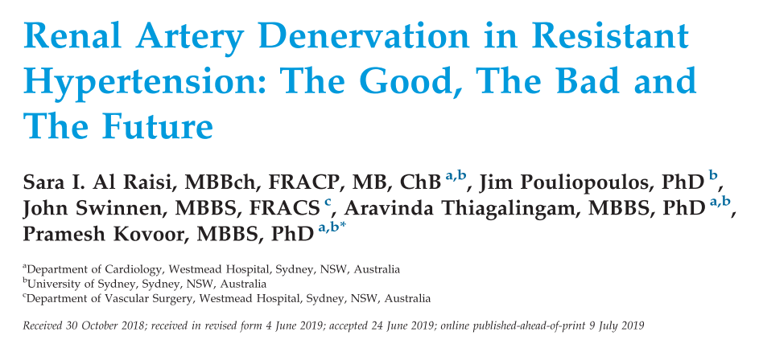
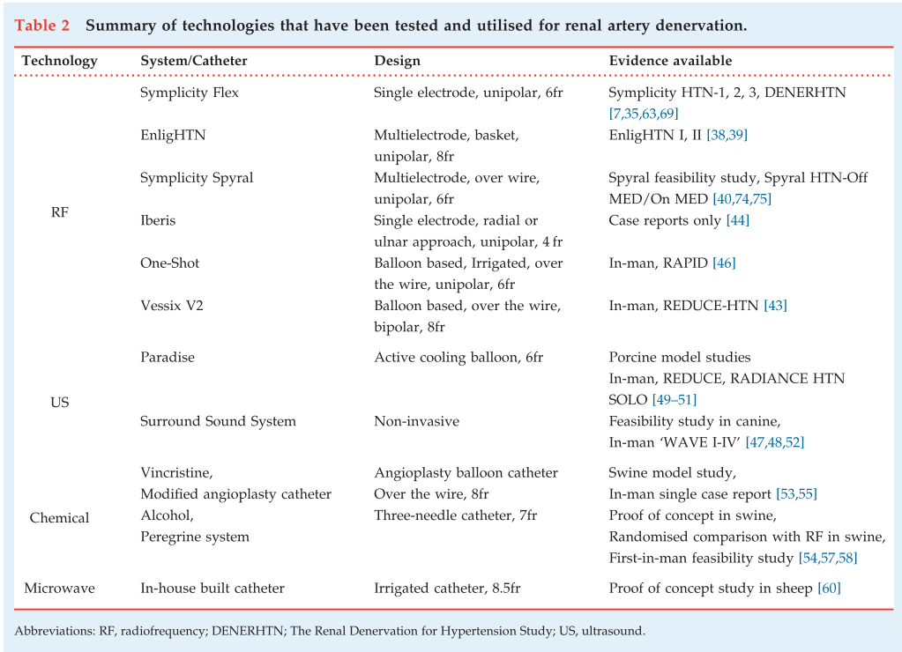
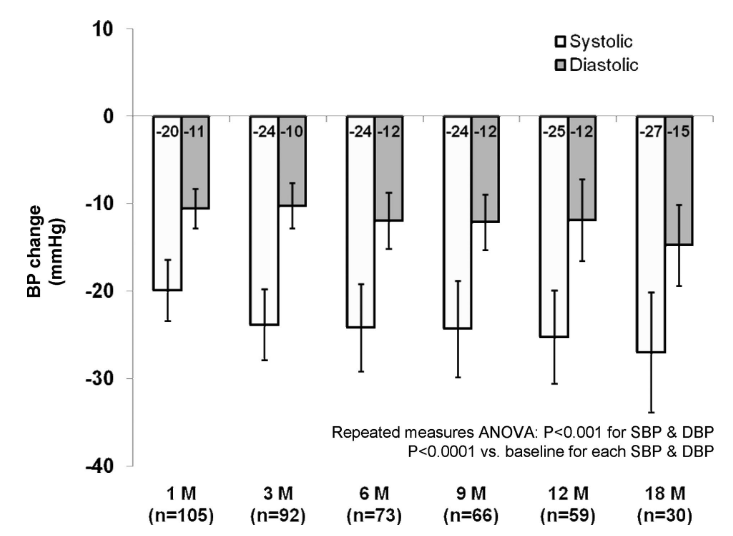
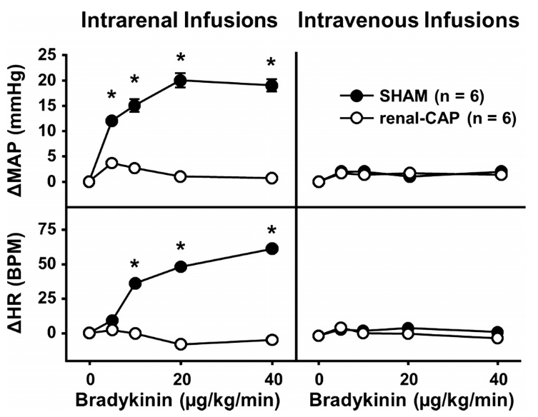
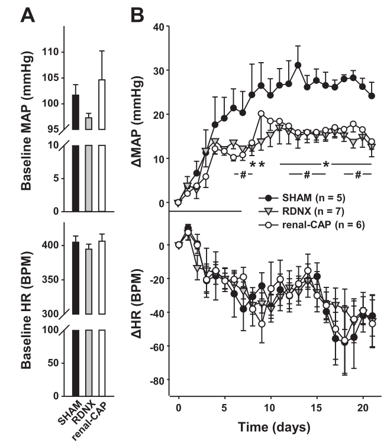
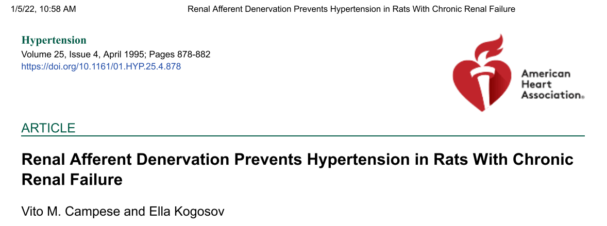
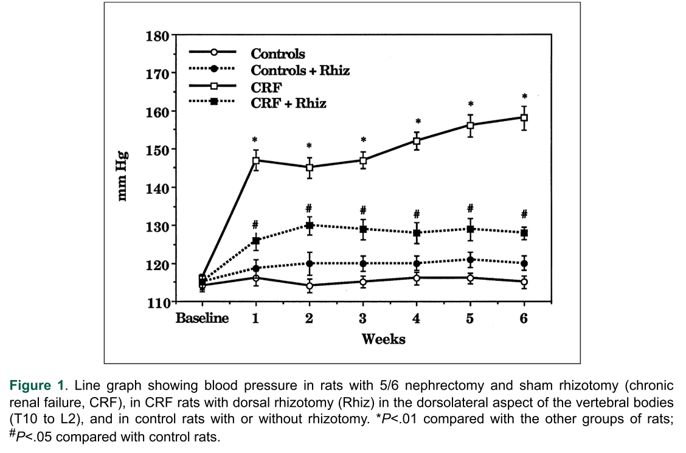
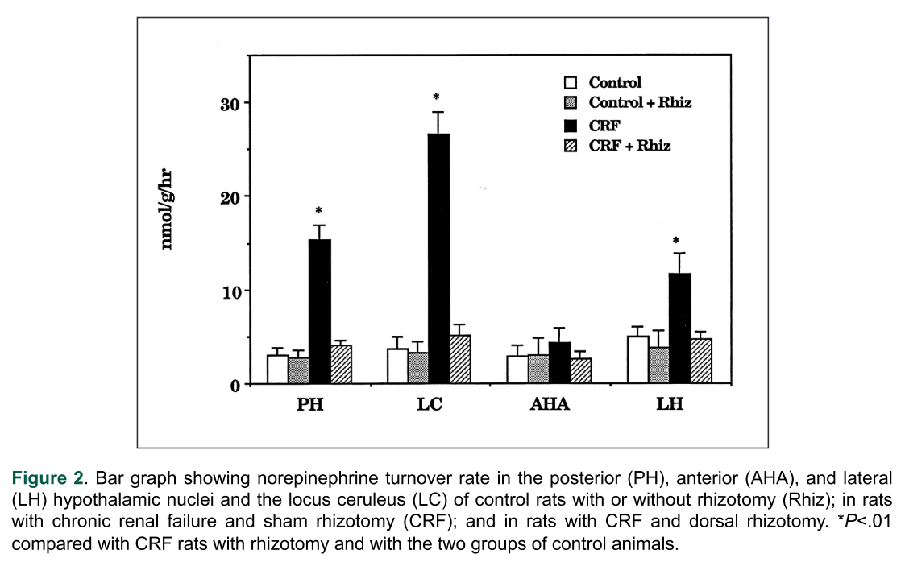
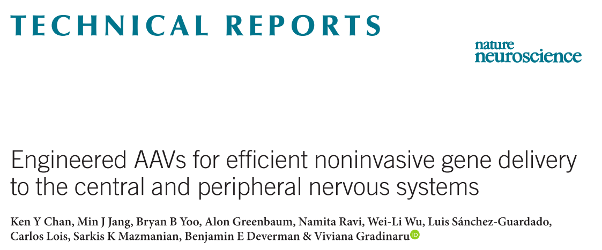
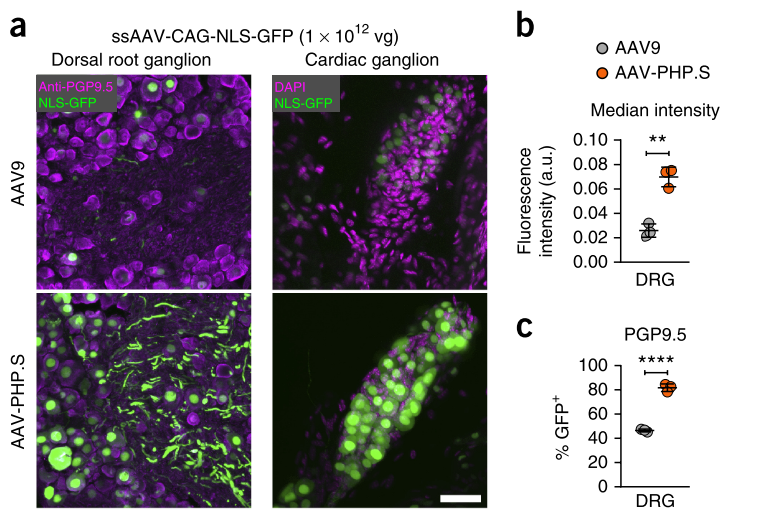

```{r setup, include=FALSE}
knitr::opts_chunk$set(echo = F)
```


# renal artery denervation for hypertension
这篇 2020 年的 review [PMID:31327701] 讲了 renal artery denervation 的方法，以及治疗效果。这些方法都是用物理化学的方式去除 renal artey nerve。 

```{r}

```

```{r}

```

---

这篇 review [PMID:21242507] 中统计的 renal artery denarvation 治疗高血压的效果  

```{r}

```

---

# renal nerve denarvation prevents hypertension
这篇文章 [PMID:25411365] 用 Capsaicin 去掉肾脏感觉神经后对血压的影响。  

肾脏动脉注射 Bradykinin 后血压和心率会升高，但是去掉感觉神经小鼠的血压基本没有变化。  

```{r}

```

在 DOCA 高血压模型中去掉肾脏感觉神经的小鼠血压升高的幅度小于对照组  

```{r}

```

---

这篇文章 [PMID:7721447] 说去掉感觉神经可以防止慢性肾衰引起的高血压  

```{r}

```

去除神经对血压的影响  

```{r}

```

去掉感觉神经对 NE 代谢的影响  

```{r}

```

---

# Tools
AAV for peripheral nervous systems

```{r}

```

```{r}

```


