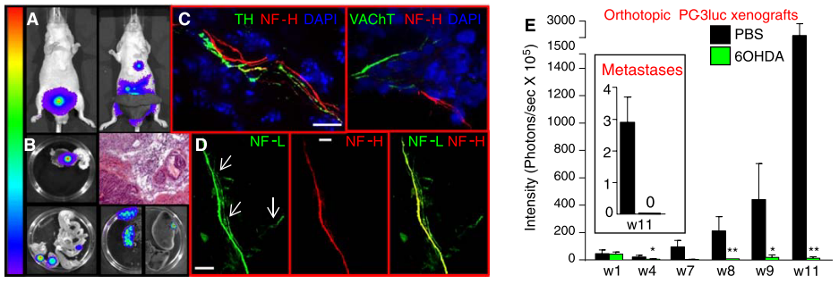
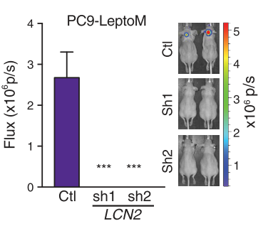
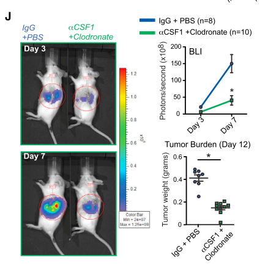
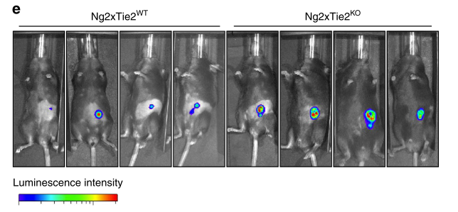

```{r setup, include=FALSE}
knitr::opts_chunk$set(echo = FALSE)
```

# plans
1. 把三次活体成像的数据放到一起，算一下统计差异？
```{r}
knitr::include_graphics("G:/data/live-image/PB3-Pdgfb.png")
```

2. PB3 接种到肾脏是否合适？
3. 要不要比较一下两组肿瘤的转移情况？其他细胞组分(F4/80, CD31, a-SMA, FSP1, vimentin)的差异？两组肿瘤生长的曲线？
4. 体外培养基中加 Pdgfb 对 PB3 生长的影响？
    - 找肿瘤生长的 marker
    - time course, dose
    - 选择一种检测方法（Q-PCR, FACS，WB，IHC）

5. 哪个受体(Pagfra/Pdgfrb)介导的对肿瘤生长的影响？
    - 药理阻断， 然后genetically knock down or knock out

6. Pdgfb 敲除是直接影响的肿瘤细胞还是间接的影响了肿瘤细胞？
7. 使用这样基因型（Cx3cr1^CreER/+^;Pdgfb^f/+^) 的小鼠做对照是否严谨？
    - 更严格的对照, 两组最好同时做
    - Cx3cr1^CreER/+^;Pdgfb^+/+^(Tamoxifen) *V.S.* Cx3cr1^CreER/+^;Pdgfb^f/f^(Tamoxifen)
    - Cx3cr1^CreER/+^;Pdgfb^f/f^ (Corn Oil) *V.S.* Cx3cr1^CreER/+^;Pdgfb^f/f^(Tamoxifen)

8. 把 RT-PCR 的数据表示成 $2^{-\vartriangle Ct}$ 的形式。


# luciferin 统计单位
1. 这篇文章[PMID:24077601]用的统计单(photons/sec)
```{r}

```

2. 这篇文章[PMID:32675368]用到的统计单位(photons/sec)
```{r}

```

3. 这篇文章[PMID:28813661]用到的统计单位(photons/sec)
```{r}

```

4. 这篇文章[PMID:28719590]用到的统计单位(luminescence intensity)
```{r}

```

